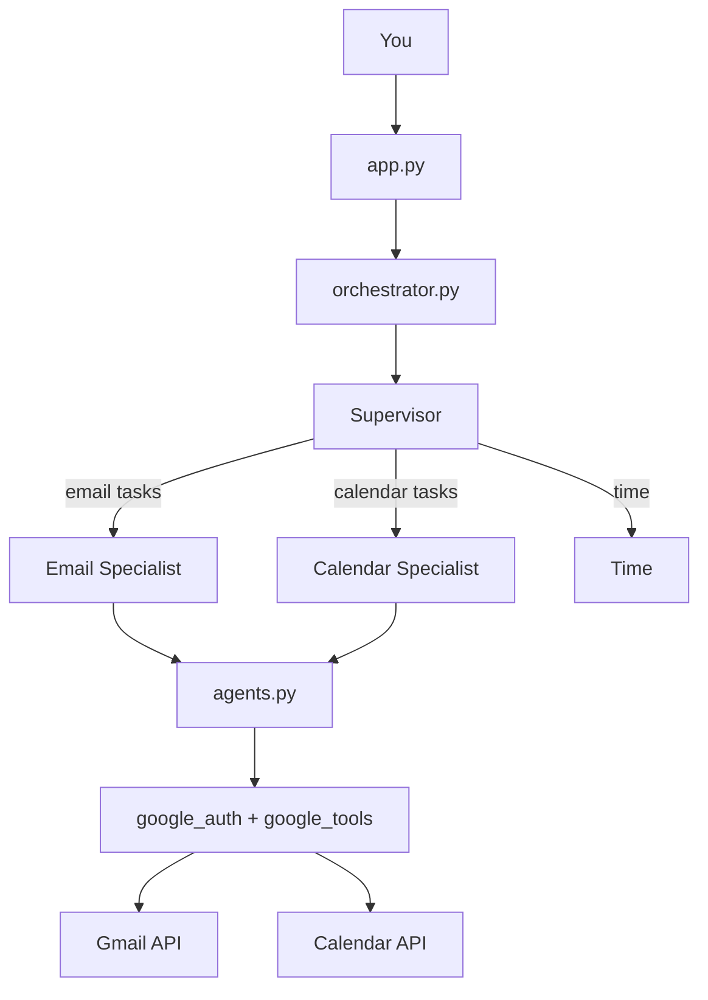

# MultiAgent Intent Router

A **supervisor-style multi-agent** assistant for **Gmail** and **Google Calendar**. You chat in the terminal; a **Supervisor** routes your request to specialist agents, then returns one clear answer.

Run the LLM **locally for free** with [Ollama](https://ollama.com), or use Groq, NVIDIA NIM, or OpenAI.

## Demo

Supervisor routing email and calendar requests in the terminal (Ollama + Google OAuth):


*Preview (first 20s). [Full demo video with audio](assets/MultiAgent.mp4) — MP4 files in git show as download links on GitHub; the GIF above plays inline automatically.*

## Quick start

```bash
git clone https://github.com/Cindy-f/MultiAgent-Intent-Router.git
cd MultiAgent-Intent-Router/personal-assistant-agent
python3 -m venv .venv
source .venv/bin/activate
pip install -r requirements.txt
cp .env.example .env
```

Edit `.env` with real Google OAuth values (not `your_client_id_here`) — see [Google setup](#google-oauth-setup).

**Ollama (free, local):**

```bash
brew install ollama
brew services start ollama
ollama pull llama3.1
```

```bash
# .env
LLM_PROVIDER=ollama
OPENAI_MODEL=llama3.1
CLIENT_ID=your_client_id.apps.googleusercontent.com
CLIENT_SECRET=your_client_secret
REDIRECT_URI=http://localhost:8080
```

**Chat (supervisor + specialists):**

```bash
python -m src.app
```

**Dashboard (Google only, no LLM):**

```bash
python -m src.dashboard
```

Type `exit` to quit chat.

## How it works



| Layer | File(s) | Job |
|--------|---------|-----|
| **Supervisor** | `supervisor.py` | Understand intent, delegate, combine answers |
| **Email specialist** | `specialists/email_specialist.py` | Gmail-only prompt + unread email tool |
| **Calendar specialist** | `specialists/calendar_specialist.py` | Calendar-only prompt + schedule tool |
| **Workers** | `agents.py` | Call Google APIs with shared OAuth |
| **OAuth** | `google_auth.py` | `token.json`, first-time login (unchanged) |

The Supervisor **does not** call Gmail or Calendar itself. It calls `delegate_to_email_agent` or `delegate_to_calendar_agent`. Each specialist runs its own tool loop, then the Supervisor writes the final reply.

**Multi-step example:** “Find my manager’s email and check if I’m free this afternoon” → Supervisor → Email specialist → Supervisor passes result as context → Calendar specialist → final summary.

## Example prompts

**Email only**

- What unread emails do I have?
- Who emailed me recently?
- Find emails from my manager.

**Calendar only**

- What's on my calendar today?
- What meetings do I have tomorrow?
- Am I free this afternoon?

**Combined (supervisor coordinates both)**

- Give me a quick morning briefing.
- Summarize my day — email and calendar.
- Find my manager's email and tell me if I'm free this afternoon.
- Check LinkedIn emails, then show today's schedule.

**Time**

- What time is it?

**Follow-ups** (same session): “Tell me more about the first email”, “What about tomorrow?”

**Limits today:** read-only Gmail/Calendar — no sending email or creating events.

## LLM providers

Set `LLM_PROVIDER` in `.env`. See `.env.example`.

| Provider | Cost | `.env` |
|----------|------|--------|
| **Ollama** | Free (local) | `LLM_PROVIDER=ollama`, `OPENAI_MODEL=llama3.1` |
| **Groq** | Free tier | `LLM_PROVIDER=groq`, `GROQ_API_KEY=gsk_...` |
| **NVIDIA NIM** | Free credits often | `LLM_PROVIDER=nvidia`, `NVIDIA_API_KEY=nvapi-...` |
| **OpenAI** | Paid / billing | `OPENAI_API_KEY=sk-...` |

On startup you should see: `Supervisor + specialists · Ollama (local) (llama3.1)` (provider may vary).

## Google OAuth setup

1. Open [Google Cloud Console](https://console.cloud.google.com/).
2. Enable **Gmail API** and **Google Calendar API**.
3. Create an **OAuth 2.0 Client ID** with redirect URI `http://localhost:8080`.
4. Put **Client ID** and **Client secret** in `.env`.

First run: open the printed URL, authorize, paste the code. Saves `token.json` (gitignored). Works with tokens from the older Node app too.

## Project structure

```
personal-assistant-agent/
├── src/
│   ├── app.py                 # Chat entry (Main)
│   ├── dashboard.py           # Table view, no LLM
│   ├── orchestrator.py        # Wires supervisor + specialists
│   ├── supervisor.py          # Router / delegation
│   ├── specialists/
│   │   ├── base.py
│   │   ├── email_specialist.py
│   │   └── calendar_specialist.py
│   ├── agents.py              # Google API workers
│   ├── google_auth.py         # OAuth2 (GoogleUtils)
│   ├── google_tools.py        # Gmail + Calendar calls
│   ├── llm_config.py          # Ollama / Groq / OpenAI / NVIDIA
│   ├── dates.py               # Local timezone dates
│   ├── cli.py                 # Terminal colors + tables
│   └── coordinator.py         # Re-export for compatibility
├── requirements.txt
└── .env.example
```

## Scripts

Run from `personal-assistant-agent/` with `.venv` activated.

| Command | Description |
|---------|-------------|
| `python -m src.app` | Chat with supervisor + specialists |
| `python -m src.dashboard` | Unread email + today’s calendar tables |
| `python scripts/live_eval.py` | Live eval: real Ollama + Google, wall-clock timing |
| `python -m pytest` | Same prompts via pytest (slow) |

## Tests

All tests use the **real** LLM (Ollama or your configured provider) and Google APIs — no mocks.

```bash
pip install -r requirements-dev.txt
python scripts/live_eval.py
# or
python -m pytest
```

Set `DEBUG_TIMING=1` (default) to print per-step LLM and tool timings during runs.

After a run, a summary table is saved to `tests/results/live_eval_summary.txt` (script) or `tests/results/test_summary.txt` (pytest) with:

- **Task success rate** (pass/fail per prompt)
- **Wall time (seconds)** per prompt and total
- **LLM calls** and separate **LLM vs tool/API** time
- **Token usage** when the provider returns usage metadata
- **Estimated cost ($)** from model pricing (Ollama local = $0)

## Troubleshooting

| Problem | What to do |
|---------|------------|
| `client_id=your_client_id_here` in auth URL | Put real `CLIENT_ID` / `CLIENT_SECRET` in `.env` |
| `command not found: ollama` | `brew install ollama`, new terminal tab |
| Connection refused on port 11434 | `brew services start ollama` |
| OpenAI `insufficient_quota` | Use `LLM_PROVIDER=ollama` or add billing |
| Wrong LLM provider | Set `LLM_PROVIDER` in `.env`, restart app |
| `ModuleNotFoundError: src` | Run commands inside `personal-assistant-agent/` |
| Google auth / token errors | Fix `.env`, delete `token.json`, run again |
| Invalid date / calendar empty | Restart app after updates; ask “calendar today” |

**Never commit** `.env` or `token.json`.

## License

Copyright (c) 2026 Cindy Fan. All rights reserved.

This software and its associated documentation files are proprietary and confidential. Unauthorized copying, transfer, modification, or distribution of this file, via any medium, is strictly prohibited.
