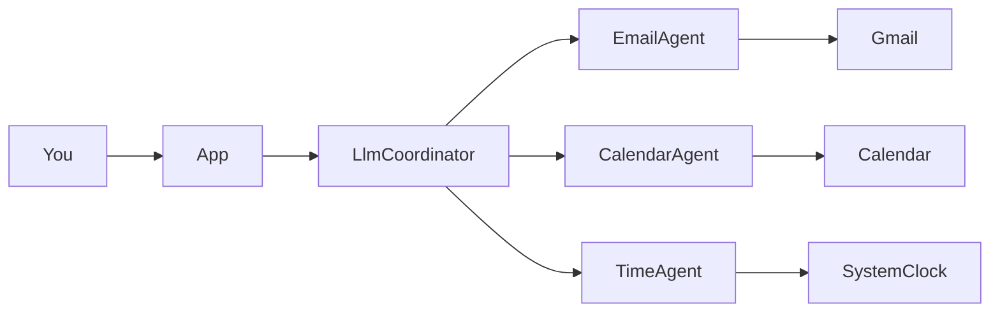

# Personal Assistant Agent

A multi-agent personal assistant that connects to **Gmail** and **Google Calendar**. An **LLM coordinator** understands natural-language questions, calls specialist agents, and returns a readable answer in the terminal.

You can run the LLM **locally for free** with [Ollama](https://ollama.com), or use cloud providers (Groq, NVIDIA NIM, OpenAI).

## Quick start

```bash
git clone https://github.com/Cindy-f/Personal_Assistant_Agent.git
cd Personal_Assistant_Agent/personal-assistant-agent
npm install
cp .env.example .env
```

Edit `.env` with your Google OAuth credentials (see [Google setup](#google-oauth-setup)).

**Free local LLM (recommended):**

```bash
brew install ollama
brew services start ollama
ollama pull llama3.1
```

In `.env`:

```bash
LLM_PROVIDER=ollama
OPENAI_MODEL=llama3.1
CLIENT_ID=your_client_id.apps.googleusercontent.com
CLIENT_SECRET=your_client_secret
REDIRECT_URI=http://localhost:8080
```

**Run chat mode:**

```bash
npm start
```

Example prompts: `What's on my calendar today?`, `Give me a quick morning briefing`, `What unread emails do I have?` — type `exit` to quit.

**Run table dashboard (no LLM):**

```bash
npm run dashboard
```

## How it works



| Component | Role |
|-----------|------|
| **LlmCoordinator** | Talks to the LLM, chooses tools, loops until it has a final reply |
| **EmailAgent** | Unread Gmail via `GetUnreadEmails` |
| **CalendarAgent** | Daily schedule via `FetchDailyMeetingSchedule` |
| **TimeAgent** | Current time via `GetCurrentTime` |

The LLM does not call Google directly. It requests **tools**; the coordinator runs the right specialist agent and passes results back to the model.

## LLM providers

Set `LLM_PROVIDER` in `.env`. See `.env.example` for full templates.

| Provider | Cost | `.env` |
|----------|------|--------|
| **Ollama** | Free (local) | `LLM_PROVIDER=ollama`, `OPENAI_MODEL=llama3.1` |
| **Groq** | Free tier | `LLM_PROVIDER=groq`, `GROQ_API_KEY=gsk_...` |
| **NVIDIA NIM** | Free credits often | `LLM_PROVIDER=nvidia`, `NVIDIA_API_KEY=nvapi-...` |
| **OpenAI** | Paid / billing required | `OPENAI_API_KEY=sk-...` |

On startup, chat mode prints which LLM is active, for example: `LLM: Ollama (local) (llama3.1)`.

## Google OAuth setup

1. Create a project in [Google Cloud Console](https://console.cloud.google.com/).
2. Enable **Gmail API** and **Google Calendar API**.
3. Create **OAuth 2.0 Client ID** (Desktop or Web) with redirect URI `http://localhost:8080`.
4. Copy **Client ID** and **Client secret** into `.env`.

On first run, follow the terminal link, paste the authorization code, and save `token.json` (gitignored).

## Project structure

```
personal-assistant-agent/
├── src/
│   ├── app.ts                    # Chat REPL (default: npm start)
│   ├── dashboard.ts              # Table UI without LLM (npm run dashboard)
│   ├── agents/
│   │   ├── llmCoordinator.ts     # LLM + tool routing
│   │   ├── emailAgent.ts
│   │   ├── calendarAgent.ts
│   │   ├── timeAgent.ts
│   │   └── assistant.ts          # Legacy wrapper (deprecated)
│   ├── config/
│   │   └── llmConfig.ts          # Provider: ollama | groq | nvidia | openai
│   ├── services/
│   │   └── GoogleServicesUtils.ts
│   └── tools/
│       ├── GetUnreadEmails.ts
│       ├── FetchDailyMeetingSchedule.ts
│       └── GetCurrentTime.ts
├── .env.example
├── package.json
└── tsconfig.json
```

## Scripts

| Command | Description |
|---------|-------------|
| `npm start` | Interactive chat with LLM coordinator |
| `npm run dashboard` | Email + calendar tables (Google only) |
| `npm run build` | Compile TypeScript to `dist/` |

## Example prompts

- What unread emails do I have?
- What's on my calendar today?
- What meetings do I have tomorrow?
- Give me a quick morning briefing.
- What time is it?

example terminal output:


## Troubleshooting

| Problem | What to do |
|---------|------------|
| `command not found: ollama` | Install: `brew install ollama`, then open a new terminal |
| Connection refused on port 11434 | `brew services start ollama` |
| OpenAI `insufficient_quota` | Use `LLM_PROVIDER=ollama` or add billing at [platform.openai.com](https://platform.openai.com) |
| Wrong LLM provider | Set `LLM_PROVIDER` explicitly in `.env` and restart `npm start` |
| Google auth fails | Check `CLIENT_ID`, `CLIENT_SECRET`, `REDIRECT_URI`; delete `token.json` and re-auth |

**Never commit** `.env` or `token.json` — they contain secrets.

## License

Copyright (c) 2026 Cindy Fan. All rights reserved.

This software and its associated documentation files are proprietary and confidential. Unauthorized copying, transfer, modification, or distribution of this file, via any medium, is strictly prohibited.
