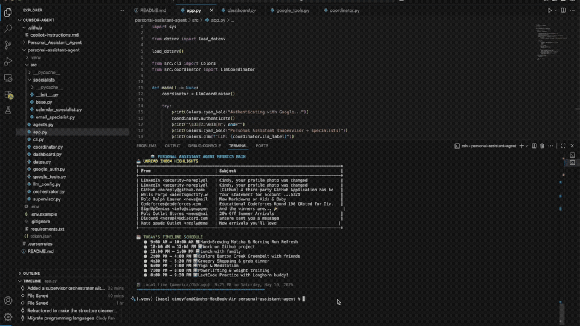
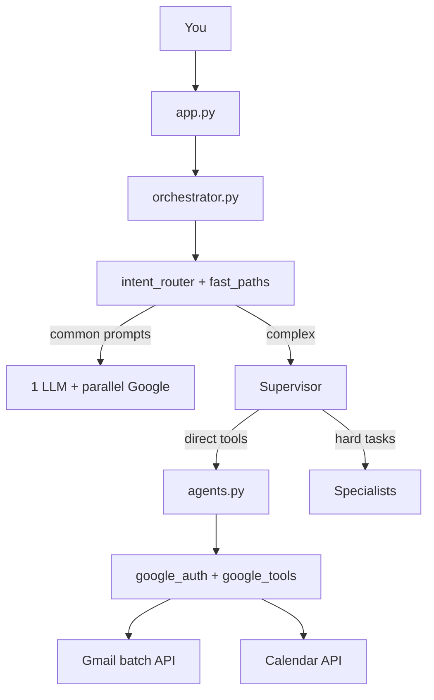

# MultiAgent Intent Router

A **supervisor-style multi-agent** assistant for **Gmail** and **Google Calendar**. You chat in the terminal; a **Supervisor** routes your request to specialist agents, then returns one clear answer.

Run the LLM **locally for free** with [Ollama](https://ollama.com), or use Groq, NVIDIA NIM, or OpenAI.

## Demo

Supervisor routing email and calendar requests in the terminal (Ollama + Google OAuth):  
Youtube link to full demo: https://www.youtube.com/watch?v=GWWPbdftdTA



*Preview (first 20s). [Full demo video with audio](assets/MultiAgent.mp4) — MP4 files in git show as download links on GitHub; the GIF above plays inline automatically.*

## Quick start

```bash
git clone https://github.com/Cindy-f/MultiAgent-Intent-Router.git
cd MultiAgent-Intent-Router/personal-assistant-agent
python3 -m venv .venv
source .venv/bin/activate
pip install -r requirements.txt
cp .env.example .env
```

Edit `.env` with real Google OAuth values (not `your_client_id_here`) — see [Google setup](#google-oauth-setup).

**Ollama (free, local — use the smaller default model for speed):**

```bash
brew install ollama
brew services start ollama
ollama pull llama3.2:3b
```

```bash
# .env
LLM_PROVIDER=ollama
OPENAI_MODEL=llama3.2:3b
CLIENT_ID=your_client_id.apps.googleusercontent.com
CLIENT_SECRET=your_client_secret
REDIRECT_URI=http://localhost:8080
```

**Groq (fastest option, free tier):** set `LLM_PROVIDER=groq`, `GROQ_API_KEY=gsk_...`, and optionally `OPENAI_MODEL=llama-3.1-8b-instant`.

**Chat (supervisor + specialists):**

```bash
python -m src.app
```

**Dashboard (Google only, no LLM):**

```bash
python -m src.dashboard
```

Type `exit` to quit chat.

## How it works



| Layer | File(s) | Job |
|--------|---------|-----|
| **Fast paths** | `intent_router.py`, `fast_paths.py` | Skip extra LLM hops for time, unread, calendar today, briefing |
| **Supervisor** | `supervisor.py` | Direct Gmail/Calendar tools; delegates only when needed |
| **Specialists** | `specialists/*` | Complex email/calendar reasoning (max 1 tool round) |
| **Workers** | `agents.py` | Google APIs + short-lived cache |
| **OAuth** | `google_auth.py` | `token.json`, first-time login (unchanged) |

**Typical flow today:** “What unread emails do I have?” → intent router → batched Gmail fetch → **one** LLM call to format the answer (not four).

**Multi-step example:** “Morning briefing” → parallel unread + calendar fetch → **one** synthesis LLM call.

## Example prompts

**Email only**

- What unread emails do I have?
- Who emailed me recently?
- Find emails from my manager.

**Calendar only**

- What's on my calendar today?
- What meetings do I have tomorrow?
- Am I free this afternoon?

**Combined (supervisor coordinates both)**

- Give me a quick morning briefing.
- Summarize my day — email and calendar.
- Find my manager's email and tell me if I'm free this afternoon.
- Check LinkedIn emails, then show today's schedule.

**Time**

- What time is it?

**Follow-ups** (same session): “Tell me more about the first email”, “What about tomorrow?”

**Limits today:** read-only Gmail/Calendar — no sending email or creating events.

## LLM providers

Set `LLM_PROVIDER` in `.env`. See `.env.example`.

| Provider | Speed | Cost | Default model |
|----------|-------|------|----------------|
| **Groq** | Fastest | Free tier | `llama-3.1-8b-instant` |
| **Ollama** | Medium (GPU helps) | Free (local) | `llama3.2:3b` |
| **NVIDIA NIM** | Fast | Free credits often | `meta/llama-3.3-70b-instruct` |
| **OpenAI** | Fast | Paid | `gpt-4o-mini` |

Override any model with `OPENAI_MODEL=...` in `.env`.

On startup you should see: `Supervisor + specialists · Ollama (local) (llama3.2:3b)` (provider may vary).

## Performance

Optimizations built in:

| Change | What it does |
|--------|----------------|
| **Gmail batch + metadata** | One list + batched `messages.get` (headers only), not N sequential full fetches |
| **Intent fast paths** | Time = 0 LLM; unread / calendar / briefing = 1 LLM; combo prompts = parallel Google + 1 LLM |
| **Supervisor direct tools** | Simple reads skip specialist sub-agents |
| **Compact tool payloads** | Truncated snippets and text summaries → smaller, faster LLM calls |
| **Session cache** | Unread + today’s calendar cached ~60s (`GOOGLE_CACHE_TTL_SEC`) |
| **Faster default models** | `llama3.2:3b` (Ollama) or Groq `llama-3.1-8b-instant` |

Optional `.env` tuning: `GMAIL_MAX_RESULTS=5`, `EMAIL_SNIPPET_MAX_CHARS=120`, `DEBUG_TIMING=1`.

Re-run timing: `python scripts/live_eval.py` — expect much lower wall time vs. the earlier multi-agent runs.

## Google OAuth setup

1. Open [Google Cloud Console](https://console.cloud.google.com/).
2. Enable **Gmail API** and **Google Calendar API**.
3. Create an **OAuth 2.0 Client ID** with redirect URI `http://localhost:8080`.
4. Put **Client ID** and **Client secret** in `.env`.

First run: open the printed URL, authorize, paste the code. Saves `token.json` (gitignored). Works with tokens from the older Node app too.

## Project structure

```
personal-assistant-agent/
├── src/
│   ├── app.py                 # Chat entry (Main)
│   ├── dashboard.py           # Table view, no LLM
│   ├── orchestrator.py        # Wires supervisor + specialists
│   ├── supervisor.py          # Router / delegation
│   ├── specialists/
│   │   ├── base.py
│   │   ├── email_specialist.py
│   │   └── calendar_specialist.py
│   ├── agents.py              # Google API workers
│   ├── google_auth.py         # OAuth2 (GoogleUtils)
│   ├── google_tools.py        # Gmail batch + Calendar calls
│   ├── google_cache.py        # Short-lived API cache
│   ├── intent_router.py       # Fast-path intent detection
│   ├── fast_paths.py          # 0–1 LLM hop handlers
│   ├── tool_summaries.py      # Compact data for the LLM
│   ├── telemetry.py           # Wall-clock LLM/tool timing
│   ├── llm_config.py          # Ollama / Groq / OpenAI / NVIDIA
│   ├── dates.py               # Local timezone dates
│   ├── cli.py                 # Terminal colors + tables
│   └── coordinator.py         # Re-export for compatibility
├── requirements.txt
└── .env.example
```

## Scripts

Run from `personal-assistant-agent/` with `.venv` activated.

| Command | Description |
|---------|-------------|
| `python -m src.app` | Chat with supervisor + specialists |
| `python -m src.dashboard` | Unread email + today’s calendar tables |
| `python scripts/live_eval.py` | Live eval: real Ollama + Google, wall-clock timing |
| `python -m pytest` | Same prompts via pytest (slow) |

## Tests

All tests use the **real** LLM (Ollama or your configured provider) and Google APIs — no mocks.

```bash
pip install -r requirements-dev.txt
python scripts/live_eval.py
# or
python -m pytest
```

Set `DEBUG_TIMING=1` (default) to print per-step LLM and tool timings during runs.

After a run, the full table is saved to `tests/results/live_eval_summary.txt` (script) or `tests/results/test_summary.txt` (pytest). Example results with **Ollama** (`llama3.2:3b`) and fast paths enabled:

| Test | Result | Wall (s) | LLM calls | LLM (s) | Tools (s) | Tokens (prompt + completion) |
|------|--------|----------|-----------|---------|-----------|------------------------------|
| What time is it now? | PASS | 0.0 | 0 | 0.0 | 0.0 | 0 |
| What's on my calendar today? | PASS | 2.2 | 1 | 2.1 | 0.2 | 79 + 32 |
| What unread emails do I have? | PASS | 8.5 | 1 | 8.0 | 0.5 | 604 + 289 |
| Give me a quick morning briefing. | PASS | 4.4 | 1 | 4.2 | 0.4 | 632 + 123 |
| Find manager email + free this afternoon | PASS | 2.9 | 1 | 2.7 | 0.3 | 647 + 61 |
| **Total (5 prompts)** | **5/5 (100%)** | **18.0** | **4** | **17.0** | **1.3** | **1962 + 505** |

Times depend on your machine, model, and inbox size. Re-run `python scripts/live_eval.py` to refresh your own numbers.

## Troubleshooting

| Problem | What to do |
|---------|------------|
| `client_id=your_client_id_here` in auth URL | Put real `CLIENT_ID` / `CLIENT_SECRET` in `.env` |
| `command not found: ollama` | `brew install ollama`, new terminal tab |
| Connection refused on port 11434 | `brew services start ollama` |
| Ollama model not found | `ollama pull llama3.2:3b` or set `OPENAI_MODEL=llama3.1` |
| Still slow | Try `LLM_PROVIDER=groq` or keep Ollama model loaded (`ollama run llama3.2:3b`) |
| OpenAI `insufficient_quota` | Use `LLM_PROVIDER=ollama` or add billing |
| Wrong LLM provider | Set `LLM_PROVIDER` in `.env`, restart app |
| `401` / `Invalid API Key` in live eval | `LLM_PROVIDER=ollama` but `OPENAI_BASE_URL` still points at Groq is the usual cause. Remove or fix `OPENAI_BASE_URL`, confirm startup prints `host=localhost:11434`. For Groq, set `LLM_PROVIDER=groq` and a valid `GROQ_API_KEY=gsk_...`. Run `ollama pull llama3.2:3b` if the model is missing. |
| `ModuleNotFoundError: src` | Run commands inside `personal-assistant-agent/` |
| Google auth / token errors | Fix `.env`, delete `token.json`, run again |
| Invalid date / calendar empty | Restart app after updates; ask “calendar today” |

**Never commit** `.env` or `token.json`.

## License

Copyright (c) 2026 Cindy Fan. All rights reserved.

This software and its associated documentation files are proprietary and confidential. Unauthorized copying, transfer, modification, or distribution of this file, via any medium, is strictly prohibited.
